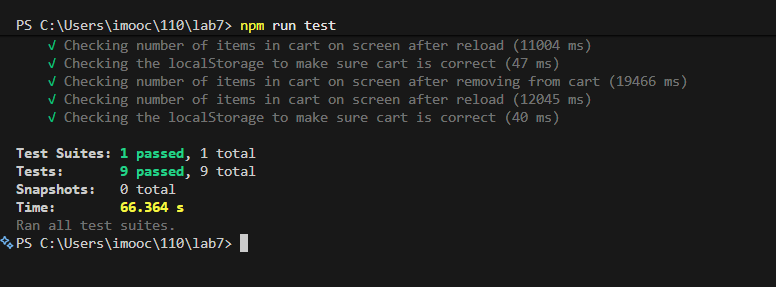

# Where would you fit your automated tests in your Recipe project development pipeline? Select one of the following and explain why
- Option 1. This ensures tests run automatically for every change, removing the risk of a developer forgetting to run them manually or catching bugs too late. For a recipe project, this is especially valuable because it protects shared features like ingredient scaling or search from silent regressions as the codebase grows.

# Would you use an end to end test to check if a function is returning the correct output? (yes/no)
- No.

# Screenshot

